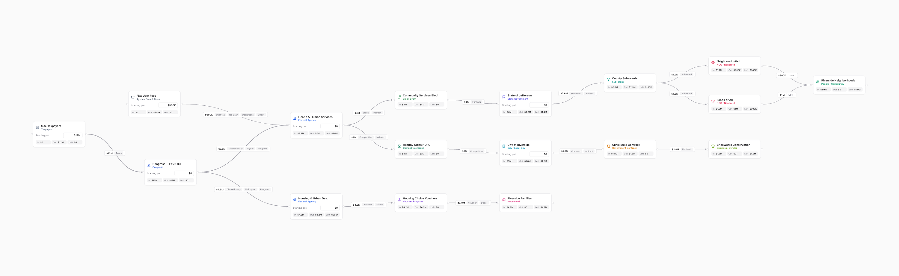

# 💸 FundsFlow

Build playful "money maps" — flowcharts of how funds move between government
organizations, grants, contracts, NGOs, and the people they help. Runs on your
machine with no backend — the only thing it ever sends anywhere is an award ID
you type into 📡 Import award, which goes straight to USAspending.gov.



## Run it

```bash
npm install
npm run dev
```

Then open http://localhost:5173.

## How it works

- **Drag blocks** from the left palette onto the canvas. They come in three
  groups — where money starts, how it moves, and where it lands — and there are
  30 of them, so there's a **search box** at the top of the palette: type
  `school`, `grant` or `housing` and the groups filter down to what matches.
- **Connect blocks** by dragging from a block's right handle to another's left
  handle — animated lines show money flowing. Click a line's pill to set the
  amount (`250k`, `1.5m`, `2b` all work).
- **Say what kind of money it is.** Open a line's details and tag it with a
  funding type (formula grant, block grant, contract, voucher, earmark,
  indirect cost recovery — 21 in all), how long it stays available (1-year,
  multi-year, no-year), whether it pays for the program or for operations, and
  whether it reaches people directly or passes through someone else. The tags
  ride along on the arrow.
- **Budget tracking**: every block shows money in, money out, and what's left.
  Send out more than a block has and it gets a friendly 😬 Over budget! badge.
- **Sources** get a "Starting pot" you can type an amount into.
- **A running total** sits along the bottom: starting money, money moving
  between blocks, money still sitting in blocks, and how many blocks are over
  budget.
- **Dark mode** — the toolbar's Light/Dark button. It starts on whatever your
  system prefers and remembers what you pick.
- **Start from a template.** The toolbar's **Templates** button opens a picker
  with six ready-made maps — FDA drug review, Title I school funding, housing
  choice vouchers, disaster recovery, an NIH research grant, and the original
  federal grant journey. Pick one from the list and it previews live on the
  right, exactly as it will look on the canvas; **Open on canvas** drops it in
  as a new map you can edit like any other. Your current map is left alone.
- Charts **auto-save** in your browser (localStorage). Keep multiple named maps
  and switch between them in the toolbar.
- **Export** any map as JSON or a PNG snapshot, and **Import** a JSON map back
  in — your own, or one someone shared with you.
- **📡 Import award** builds a map from a real federal award. Type a PIID or
  FAIN (try `N0001919C0001` or `2146755`) and it fetches the award from
  [USAspending.gov](https://api.usaspending.gov), then draws the awarding agency,
  the award itself, and the recipient with the obligated amount on the arrows.
  Coverage starts October 2007.
- A **minimap and zoom controls** sit in the corner, and the view frames itself
  whenever you switch maps or import one.

## The building blocks

**Where money starts** — give these a starting pot: Taxpayers, Congress,
U.S. Treasury, Federal Agency, State Government, City / Local Gov, Tribal
Government, School District, Agency Fees & Fines, Private Foundation.

**How money moves** — pass money along: Grant, Formula Grant, Block Grant,
Competitive Grant, Cooperative Agreement, Sub-grant, Government Contract,
Private Contract, Interagency Agreement, Earmark, Loan / Guarantee, Tax Credit,
Voucher Program.

**Where money lands** — the good it does: NGO / Nonprofit, Business / Vendor,
Program / Project, University / Research, Hospital / Clinic, Household,
People / Community.

## Stack

Vite + React + TypeScript, [React Flow](https://reactflow.dev) (`@xyflow/react`),
zustand (with localStorage persistence), html-to-image for PNG export.

## License

[MIT](LICENSE)
